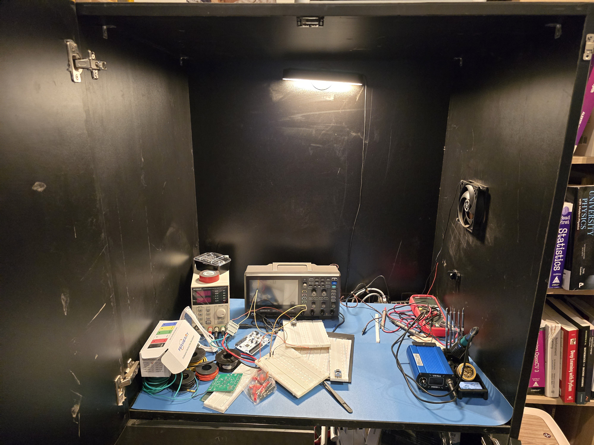
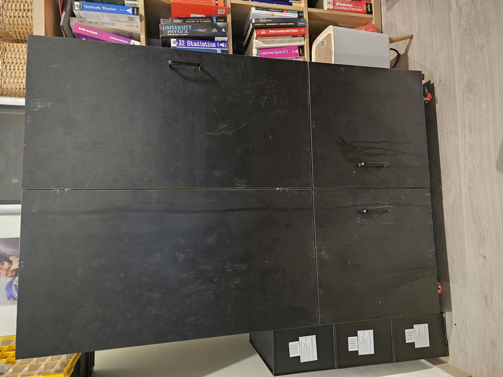
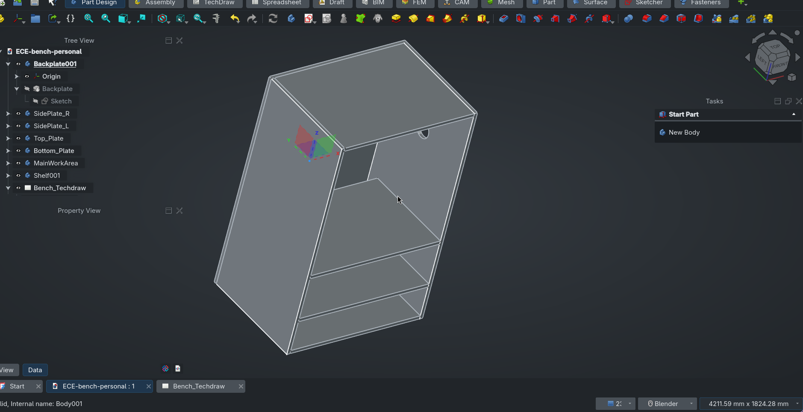

# ece-bench

A design for a cat proof ece bench

This repo is a model for my current ece bench, and to plan upgrades to. Hopefully someone somewhere with similar needs can build off this template.

This design came from a need for a cat safe place to do electronics stuff.

Finished look

CAD preview:

# Note

1. The CAD model doesn't include doors or service holes
2. The large open backplate was originally for a monitor mount, but the idea has been dropped since then

# Drawbacks

1. The height was a miss. Instead of 1350 mm I should've pushed for something closer 1500 mm, which would've been comfortable even for a 3d printer on top, while giving more room inside.
   A suggestion if you're building off this, please take your own height into consideration and build off that.

2. The workbench is far too low. And the gap between the work area and Shelf001 (in the cad model), is too little in my opinion. I wish I raised the work area a bit, to give more of a gap for storage units

3. _DO NOT_ attempt to solder in this space. The cutouts for fans on the right panel are great, but I've only been able to place PC fans on it. It's no where near enough to move solder fumes out of it, and the work area gets really constrained if you place a fume extractor there. I personally, keep my soldering units on shelf001 and move it out to benchtop when needed

4. Although it fits a PSU, scope and a function generator, the plan is to add shelving units to extend upwards
